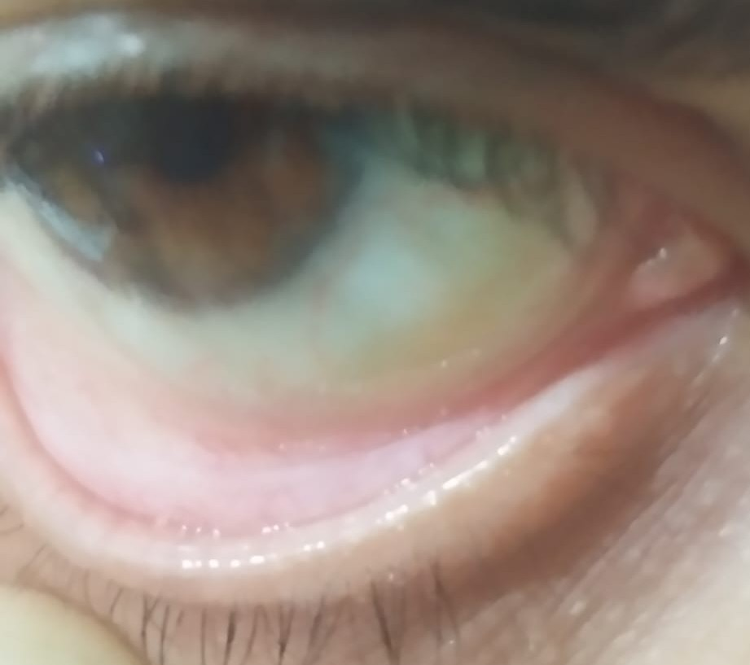

# AI-based Anaemia Detection using Conjunctiva Images (ML + CNN + XGBoost)

## Overview

This project predicts anaemia using conjunctiva (eye) images by combining image processing, deep learning, and machine learning techniques.
It extracts meaningful features from eye images and estimates hemoglobin (Hb) levels along with severity classification.

---

## Features

* Image preprocessing and normalization (color correction)
* Conjunctiva ROI (Region of Interest) extraction using adaptive thresholding
* Feature extraction:

  * Handcrafted features (color + texture)
  * CNN features using ResNet50
* Dimensionality reduction using PCA
* Hemoglobin prediction using XGBoost regression
* Severity classification:

  * Normal
  * Mild Anemia
  * Severe Anemia
* Confidence-based prediction output

---

## Tech Stack

* Python
* OpenCV
* NumPy & Pandas
* Scikit-learn
* XGBoost
* TensorFlow (ResNet50)
* Matplotlib

---

## Output

* Predicted Hemoglobin (Hb) level (g/dL)
* Severity classification:

  * Normal (Hb > 11)
  * Mild Anemia (8.5 < Hb ≤ 11)
  * Severe Anemia (Hb ≤ 8.5)
* Probability/confidence scores for each class

---

## 🖼️ Sample Input

